# Team Name: The Sinister Six

## Scrum Team
 - Morgan Hulsey (Scrum Master)
 - Lily Nguyen (Product Owner) 
 - Nitya Pandeti (Dev)
 - Bear Kruz (Dev)
 - Reema Amhaz (Dev)
 - Polina Ibragimova (Dev)
 
   ### Slack Channel: thesinistersix
 
 
## Product Iteration (Summer 2020)
* __Name:__ StellAR
* __Product Description:__ Interactive Spatial Platform that makes interstellar space easier to reach by providing education about space exploration through a fun and accessible AR application.
* __Far Vision:__ Create the next space generation by bringing outerspace closer to earth.
* __Product Iteration Near Vision:__ Space at the tip of your fingers.
<!--* __Key Architecture:__ 
  * Infrastructure: 
  * Languages: 
  * Backend Datasource: -->
  
  
## Stakeholder type examples:
1.  Senior Educational Outreach and STEM Engagement Specialist @ NASA
2.  Masters Student studying Unmanned Systems Technology
3.  Mother of child who is learning about space

## Real-life Stakeholders:
Jamarius Reid    (Masters Student studying Unmanned Systems Technology)

Here are more a in-depth profile of our Stakeholder.
User Persona for Real Stakeholder | Details
--- | ---
Stake Holder name | Jamarius Reid  
Age | 25
Education | Embry-Riddle Aeronautical University, Master of Science in Unmanned Systems, Space Operations
Skill Level in Mobile Application Development | Intermediate
Experience in Software Engineering | Beginner
Knowledge level in Astronomy | Intermediate
Motivation/Goals for Product | My motivation to share this amongst my friend would be to gauge interests and also educate them on topics that they have interests in (i.e. make it more accessible, encourage more people to apply while sharing space topics).
Inconveniences | Not have an immediate resource to reference in conversation and(or) fact check my interpretation of space events.
Features | 1. When launching the app for the 1st time the user can select topics (i.e. genres) that interest them so that relevant information can populate their feed. 2. The accessibility to search prevalent information. Could double as an encyclopedia for NASA or Space exploration and initiatives.
Personality traits | Extroverted, Intuitive, Feeling, and Judging 

Jimmy Acevedo    (Senior Educational Outreach and STEM Engagement Specialist @ NASA)

User Persona for Real Stakeholder #2 | Details
--- | ---
Stake Holder name | Jimmy Acevedo 
Age | 35
Role | Senior Educational Outreach and STEM Engagement Specialist @ NASA
Skill Level in Mobile Application Development | Low
Knowledge level in Astronomy | Intermediate/High
Motivation/Goals for Product |  Increased accessibility and excitement with space exploration
Inconveniences | Lack of usable AR interfaces (Snapchat etc. have high barriers to entry)
Features | 1. Easy content-management system for pushing out fresh information. 2. ‘Hot topics’ temporary way to feature content relevant to current events, e.g. optical communications facts near LCRD launch.
Personality traits | Resourceful, Creative, Empathetic, Impulsive, Playful

## Definition of Ready:
1. Item has a title, description, user story, is estimated, has a defined acceptance criteria  
2. External and internal dependencies are resolved 
3. Meets INVEST criteria 
4. All resources are available: funding, people, skills, servers, etc. 
5. Stakeholders have been interviewed

## Definition of Done:
1. All acceptance criteria has been met
2. No regressions 
3. All unit and automated tests pass which cover acceptance criteria
4. Product owner accepts the story
5. Customer is satisfied (post-demo approval)
6. Code is peer-reviewed
7. No code bugs
8. Code coverage is as good as or better than last commit 
9. Performance is as good as or better than previous deployment 
10. No new technical debt
11. All code was pair/mob programmed

## Backlog:

   ### User Stories
   Order | Title | Opening Sentence | Estimated Story Points | Details / Story | Acceptance Criteria(what you want this feature to accomplish) | Rationale for Order
   --- | --- | --- | --- |--- |--- | ---
  1 | Share information about the Artemis mission on social media | As a masters student I want to a way to share my passion about the Artemis mission with my friends and family through instagram. | 3 | I am struggling to share my passion about the Artemis mission with my friends and family. I am a constant user of social media, and I connect with most everyone through those social channels. I want a way to share information on this mission through instagram. | We agree it will be complete when 1. The masters student can access a filter about the Artemis mission. 2. The filter can be used in Instagram. 3. When using the filter, it shows the student's face on the mission. 4. The captured image displays text about one random fact on the mission in English. 5. There are five random and non repeated facts in the Fact Pool. | We interviewed our primary stakeholder and he told us that an Instagram filter is what he thinks will attract attention from his friends.
  2 | Access a  Platform in which to learn about new interstellar discoveries happening everyday | As a parent, I want it to be easy for my child to stay up to date information about NASA missions, and discoveries. | 5 | As a parent of an inquisitive child, I am having trouble teaching him about space.  I know there is a lot of information on current outspace findings, missions, and resources, but I cannot seem to find this information in one place.  It is a lot of work for me to keep my child interested, and engaged, when it is taking me hours to compile the information that I want to share with him. I would love to have a mobile app, like I do for everything else, that would help me share this information with him. | We agree it will be complete when: 1. The parent can access a mobile app that provides a few data points on the artemis mission 2. The app is functional in the App Simulator | Our stakeholder wants to use the app regarless of her locations and she suggests having an mobile application would be really convenient for her child to use
  3 | Centralized space information | As an educational outreach & stem program facilitator, I want a way to access current space events to share across classroms. | 3 | As a facilitor of education, I cannot find an iteractive experience, or wealth of information on current space events.  I am responsible for ensuring that teachers, schools, and stem programs can incorporate accurate, and real time access to intestellar information, but nothing currently exists. | We agree it will be complete when: 1. There is a homepage that serves as the portal towards the AR world. 2. There are buttons for the user to enter the AR portal(s.) 3. There is a button for the user to return to homepage if wanted. 4. There is a button for the user to switch from the app to the filter and vice versa. | Our stakeholder also suggests a homepage to access the AR world easily.
 4 | Explore space onboard the hubble telescope. | As an active student on facebook, I want to explore hubble telescope findings with friends and family | 3 | As a masters student, entrenched in my studies on the hubble telescope, I am unable to find unique experiences related to this topic.  I also want to share these things with my friends, and I feel tremendous responsibility to get the word out about new discoveries. There are not many tools out there that provide interactive experiences around space. | We argee it will complete when: 1. There is at least one more additional initial filter about the Hubble telescope. 2. The additional filter can be used in Instagram. 3. The additional filter has the same features as the first one. 4. Users can shuffle between different filter types. | Our stakeholder wants to have different filters with diverse facts of the Hubble telescope
5 | Use AR worlds to bring instellar discoveries to life | As a mother there is no way to expose my child to current intestellar discoveries in a way that excites, and educates. | 13 | As a mother of many boys, I can't seem to find a way to bring outspace closer to them.  For example, I can't find a way to share with them interesting space objects.  I want it to be visually stimulating, accessible, fun and enjoyable. | We agree it will complete when: 1. There is an AR world. 2. The AR world renders when the user changes viewpoints. 3. There are spcaebodies in the AR world. 4. When a spacebody is clicked on, facts about that spacebody will be displayed. 5. There are unique facts in addition to the displayed information. | Our stakeholder is interested in using the AR technology due to its interactive and informative format.
6 | Continually engage with more AR worlds to explore | As a student studying unmanned systems in space I want to explore more AR worlds | 20 | As a student studying unmanned systems in space, I am looking to get even closer to the world I study.  Once I close my textbooks, I struggle to find a captivating way to continually feed my desire to experience all the discoveries made by NASA.  Studying textbooks is one thing, but I want to experience what I'm studying, and bring it to life. | We agree it will complete when: 1. There is an additional AR world. 2. The additional AR world is seperated to the first AR world. 3. The additional AR world has the same features as the first AR world. 4. The additional AR world has different space topic to the first AR world. | The stakeholder expected to have a different AR world that brings distinct experience and information. Thus, he can learn more from using the app.
7 | An unified experience regarless of device formats | As a mom constantly managing different devices used by my child, I want my child to easily access & learn about outer space | 3 | As a mother, I am constantly managing all the devices that my children use to access entertainment and education.  This creates a world of trouble when an application that my child loves is not available from one device to another. | We agree it will complete when: 1. The app adjusts properly when moving between devices of different common sceen sizes. 2. The app remains consistent when switching between screen dimentions, between portraint and landscape mode. | Our stakeholder wants to use the app regarless of what devices she has. She doesn't want to be limited in only one type of device.
8 | Maintaining the curiousity of users regarding space knowledge | As a mom, I want my child to be exposed to new facts about space so his interest in space is continually engaged. | 5 | As a mother of three children, attention span is a big problem in my house.  Pile on top of that trying to keep my kids focused, and engaged, a topic is even more challening.  It becomes my responsibility to keep them excited and learning something new which creates a lot of work for me.  I would love to be able to push facts of the day to my children to help with this. | We agree it will complete when: 1. There is a push notification "Fact-of-the-day." 2. The notification displays space fact every 24 hours. 3. The fact is up-to-date and non repeated. 4. User can opt out if wanted. | Our stakeholder suggests knowing an unique fact everyday is a good way to remind her to use the app often.
9 | An easy tool to look up information about space | As a mom, I want to have an easy way to look up information. | 8 | There is a lot of content that is cumbersome, and unusable, on other applications that I use, and I really need a way to easily search the application for the information that I am looking for.  I want to make sure that I can help answer questions that my child might have, and they can search through the information they are looking for. | We agree it will complete when: 1. There is a search button to look up all information in the app. 2. The information is from the app database. 3. There are keywords and key phrases relevant to user's searching needs. | Our stakeholder wants to confirm his space knowledge  or find the answers quickly, without manually flipping through pages.
10 | Users can provide feedback to the developers directly | As a student, I want to share feedback so that it improves my experience. | 3 | I a student totally engaged in the interstellar world, I have no outlet in which to share ideas and ways to bring outspace to life.  Allowing me to share this feedback will provide a way for me to collaborate with this tool to improve my experience, and maybe the experience of others. | We agree it will complete when: 1. There is a testimonial section. 2. User can rate the app via the section. 3. User can share opinion about the app via the section. 4. User can receive confirmation notice that the feedback has recorded. | Our stakeholder wants to share his thoughts and be heard when using the app as part of his contributions in the future's development of this interesting tool.
11 | Users learn about how the app works | As a mom, I want to be able to easily understand how this app works so that I can ensure my child yields the most value. | 2 | AR is forieng to me, but a technology that I want to share with my children.  However, I am scared that it will be over my head.  I want to have a way to best understand how to navigate and draw value from resources within our AR interface so that my children will enjoy it also. | We agree it will complete when: 1. There is a Frequently Asked Question page. 2. The page has all basic instructions for users to navigate in the app. 3. The page has additional suggestions for users to achieve the maximum learning benefits of the app. | As a new user, our stakeholder wants to navigate easily and have questions answered quickly while using the app. 

# Sprint1

## Story Point Estimating session
6/30/2020 - Everyone was involved. Lily presented the story in planningpoker.com and everyone in the dev team votes and came to a consensus on the story points for each story. 

We made a Sprint Goal, and decided that we work work on Backlog Items 1-3. So therefore we were able to forcast that we could do 11 Story Points for Sprint 1.

## Backlog Item Breakdown, Google Spreadsheet kanban board, & Sprint Burndown Chart
During our Sprint Planning, we were able to breakdown our 3 backlog item into 19 tasks. We assigned to a single team member or to multiple members for mob or pair programming sessions. And we also had a column in our Google Spreadsheet to document the Status of each Individual Tasks and we changed the status from In Progress to Done as we started working on the tasks and completed tasks. This is what we used as our Kanban Board

We also had the below burndown chart in Spreadsheets to track how many story points we finished in each day of the Sprint.

## Daily Scrum
Each day during our sessions we conducted by the Scrum Master. During these scrums, we asked these questions: What did we do in the last 24 hours? What did we do we plan to do in the next 24 hours? Did we have any impediments?And how do we plan on resolving them?

## Team Work during Sprint 1
We did a lot of Mob progrmam as shown in the below screenshots

## 10 TDD Tests
We were able to use 10 TDD react-native tests to help us figure out the app navigation
These are the 3 commits that encompase the testing code
https://github.com/nbpandeti/the-sinister-six/commit/b3482b1b96ced70cf280ba36035cd37f7ec21815

https://github.com/nbpandeti/the-sinister-six/commit/79ab0e001e82f3681b6098cb4e05ffd0ce0aa227

https://github.com/nbpandeti/the-sinister-six/commit/6ee80b4aa4a3d6bd7e10641bcb2302d4debbc27a

And they all PASS!!
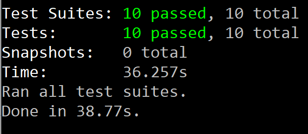

## StakeHolder Review
We had a Stakeholder review with our Stakeholder Jamarius. And we were able to demo our deliverables and get his feedback.
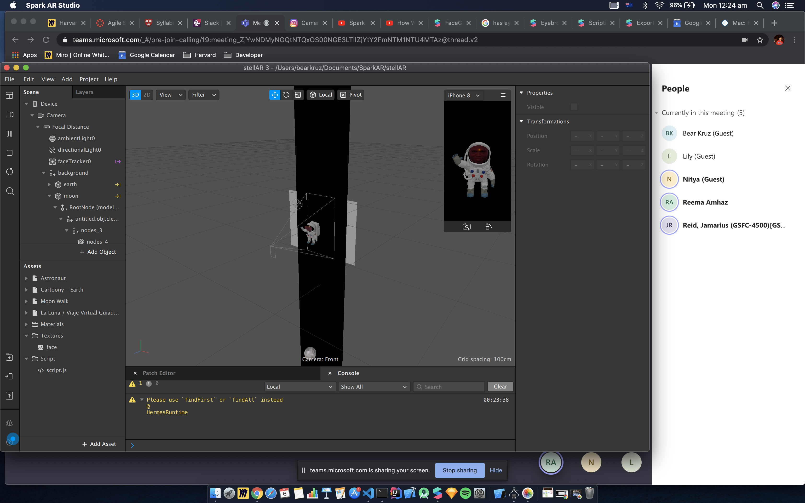
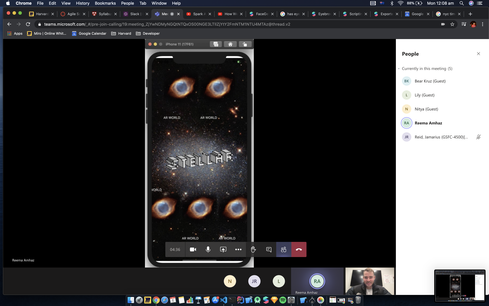

Based on his feedback, we had 2 new user stories that we will add to the top of our backlog for Sprint 2

## Sprint 1 Review/Retro
We had a team Review and Retro after our Stakeholder review.
We went over what we got done, what we didn't do. We evaluated our Sprint. We went over what went well and what didn't go well. And also made a plan for what to do for next sprint.

# Sprint2

## Story Point Estimating session
7/6/2020 - Everyone was involved. Lily presented the story in planningpoker.com and everyone in the dev team votes and came to a consensus on the story points for the 2 newly added userstories based on our stakeholder's input from Sprint 1's demo and review. 
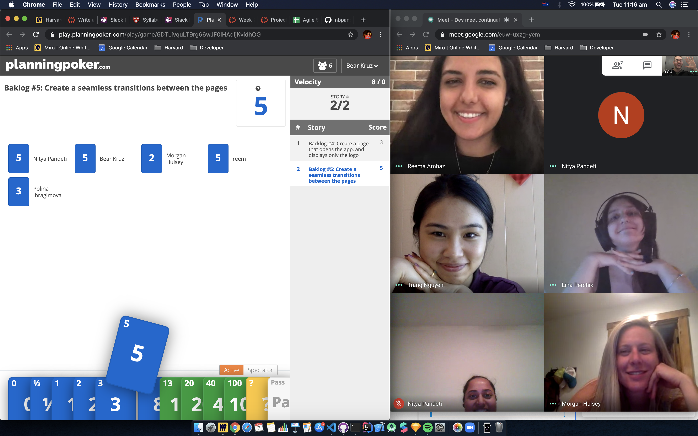
We made a Sprint Goal, and decided that we work work on Backlog Items the new Backlog items 4 & 5 as well as the previous Backlog items 4 & 5, which are now backlog items 6 & 7. So therefore will work on Backlog item 4-7 and we were able to forcast that we could do 27 Story Points for Sprint 2.

After looking at our yesterday's news. We determined that we would be able to work on 27 Story Points because we had already gone through most of our research in Sprint 1, and we determine that we could ramp up our productivity and power through this necessary functionality.
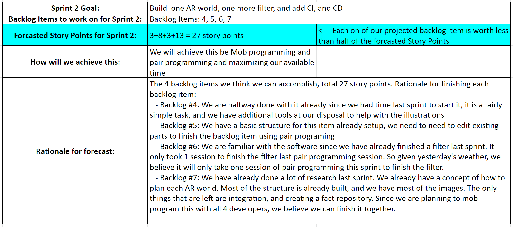

## Backlog Item Breakdown, Google Spreadsheet kanban board, & Sprint Burndown Chart
During our Sprint Planning, we were able to breakdown our 4 backlog item into 30 tasks. We assigned to a single team member or to multiple members for mob or pair programming sessions. And we also had a column in our Google Spreadsheet to document the Status of each Individual Tasks and we changed the status from In Progress to Done, or Won't Do (if task invalidated) as we started working on the tasks and completed tasks. This is what we used as our __*Kanban Board*__
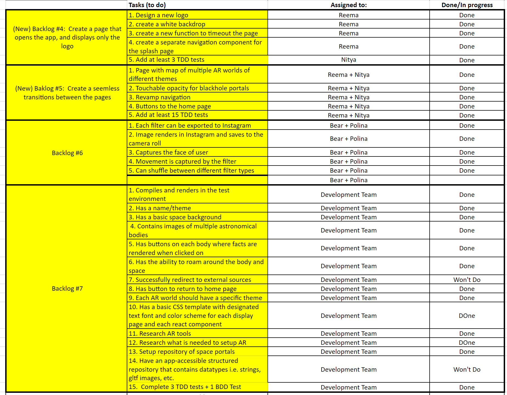
We also had the below burndown chart in Spreadsheets to track how many story points we finished in each day of the Sprint.

## Daily Scrum
Each day during our sessions we conducted by the Scrum Master. During these scrums, we asked these questions: What did we do in the last 24 hours? What did we do we plan to do in the next 24 hours? Did we have any impediments? And how do we plan on resolving them?

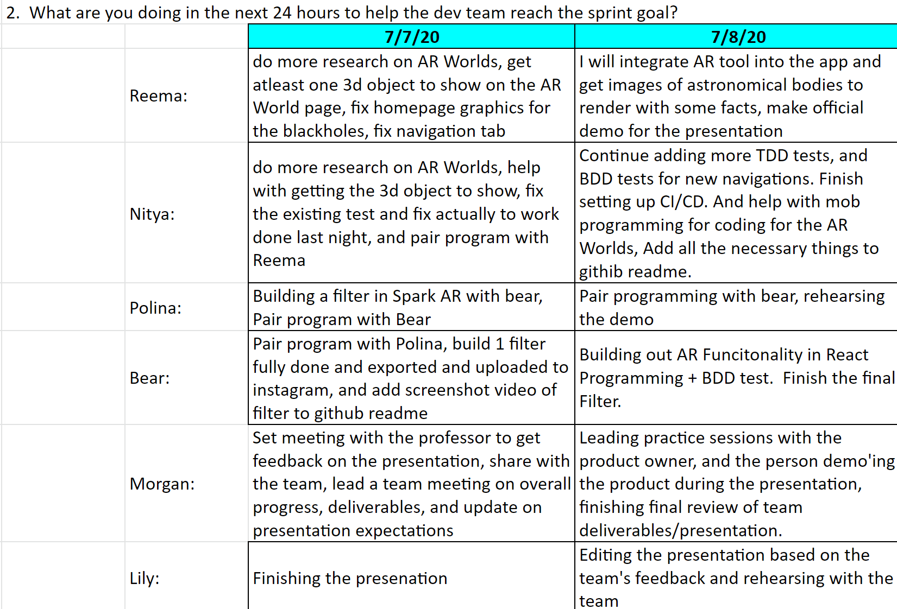
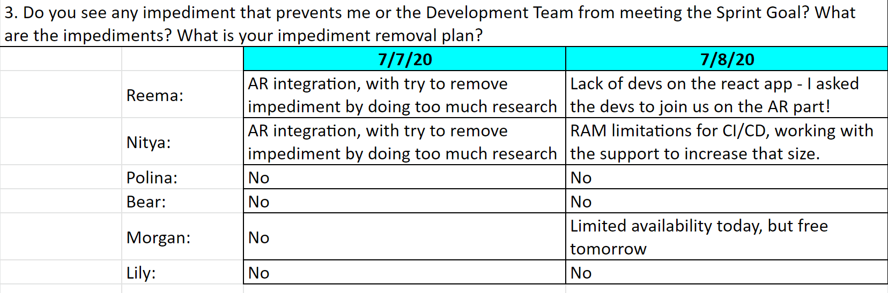

## Team Work during Sprint 2
We did a lot of Mob progrmam as shown in the below screenshots
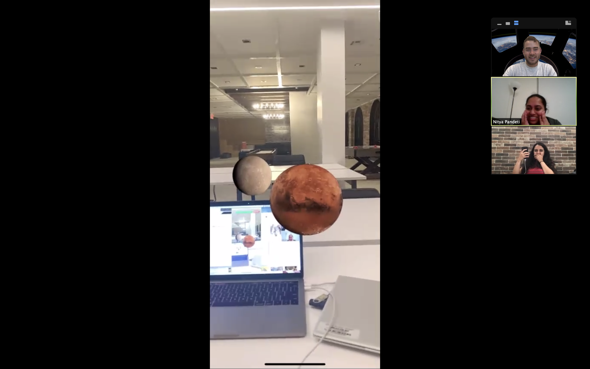

## 10 TDD Tests
We were able to use 23 react-native tests to help us figure out the app navigation
Our tests are all contain withing the _test_ directory
https://github.com/nbpandeti/the-sinister-six/tree/master/__tests__

And they all PASS!!
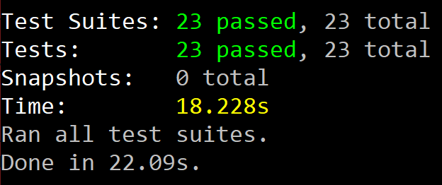

## CICD
We set up a CICD pipeline using a service called Buddyworks.
This pipeline is triggered on push of a commit to github. If the pipeline fails, we get a notification in our the-sinister-six slack channel. And we also have a notification for the first successfull pipeline run after a failure.
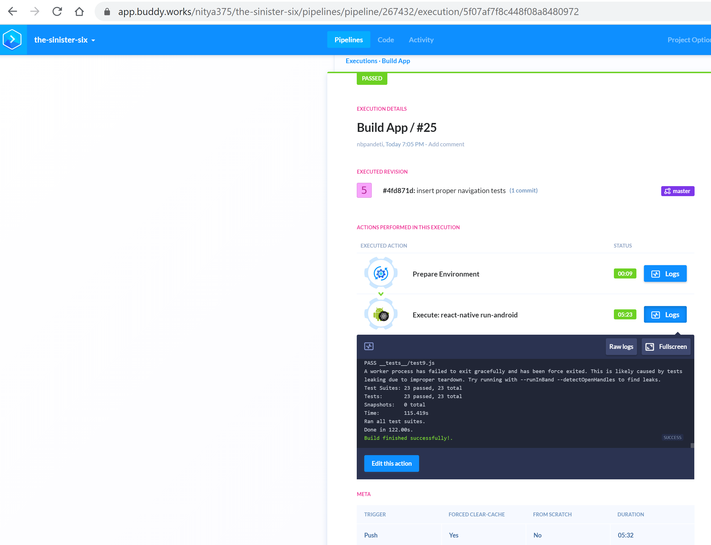
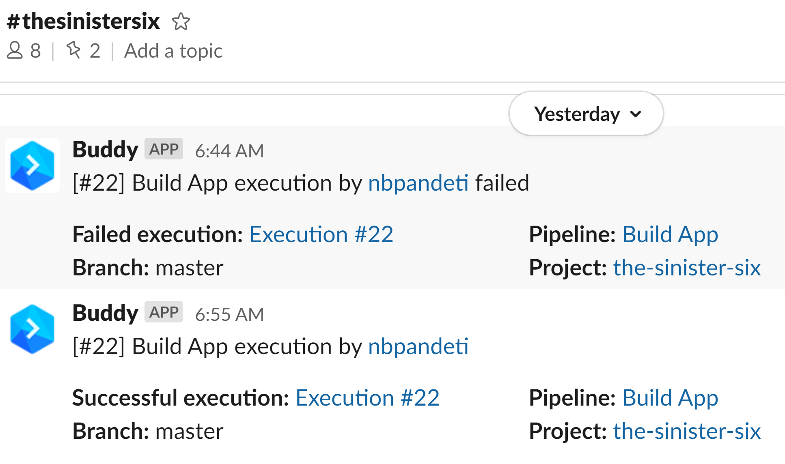

## StakeHolder Review & Sprint 2 Review
We had a Stakeholder Demo and Sprint 2 Review during class
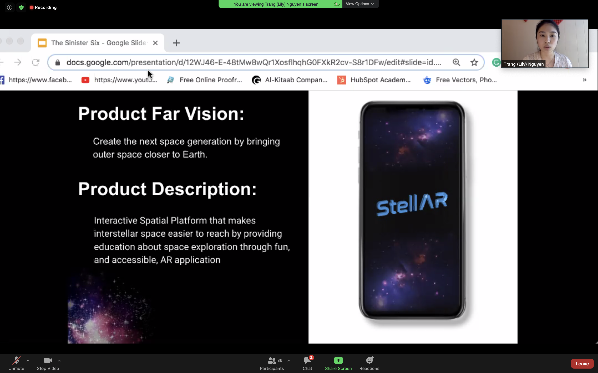
We also had a practice session in a meeting prior to class from 1-1:45pm EST. We went over the presentation slide deck created by Lily (our PO). We determined the order and transitions between our speakers, Lily, Reema, and Polina. And we also did a try run presentation to make sure that everything including our demo and Menti feedback from our classmate stakeholders, was done in our time limit.
Below is the link to the presentation slide deck:
https://docs.google.com/presentation/d/12WJ46-E-48tMw8wQr1XosflhqhG0FXkR2cv-S8r1DFw/edit#slide=id.g8b3de28238_0_734

### Stakeholder feedback
We had a Menti poll and questions as a way to get stakeholder feedback from our class. And we determined that for our next sprint, our highest priority is User Story #10 which is a daily popup notification with a fact of the day. And as such we would like to prioritize User Stories 10, 8, & 9 for Sprint 3

## Yesterday's News & Future Forcast
After looking at our yesterday's news, we determined that we need to 2 more sprint to finish our backlog items. We work really well together. We think we can finish our existing user stories and in the future submit this app to the Google Play Store and the Apple Store.
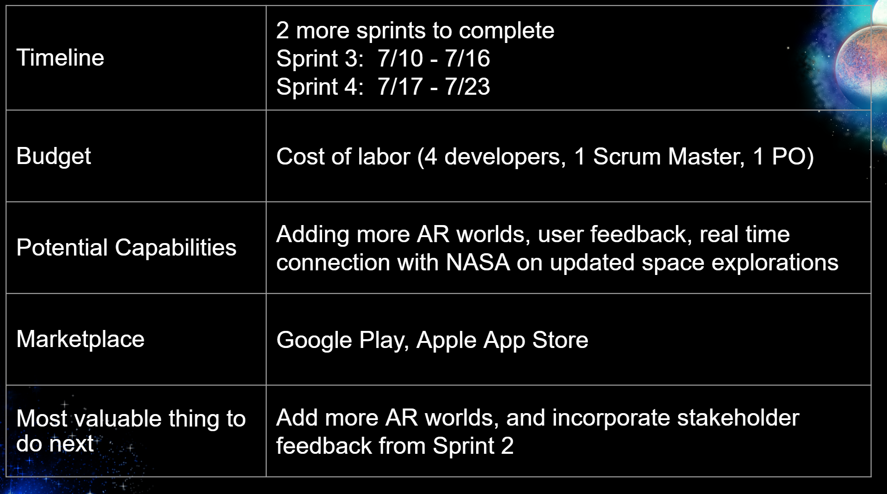

## Sprint 2 Retro
We had also had Retro.
We went over what we got done, what we didn't do. We evaluated our Sprint. We went over what went well and what didn't go well
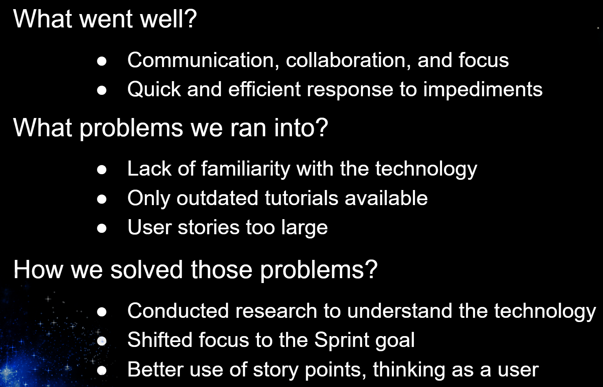

## Artemis AR Filter for Social Media: 
[Link to Live Filter](https://www.instagram.com/ar/796068967599219/?ch=NTZlZDc1ZDMyMjJiOGY1NWFjZDA5NjIxNmJmZjBkZjg%3D)
*Blink to explore NASA's Artemis Mission!*

## Planets AR Filter (Which Planel Are you?) for Social media:
[Link to Live Filter 2](https://www.instagram.com/ar/2936427273146098/?ch=NDI0NmYzMTk3MzIzZjM5MjM4YjM5Njc4MDk5N2IzMjU%3D)
*Pause to Find out Which Planet You Are*

## AR App
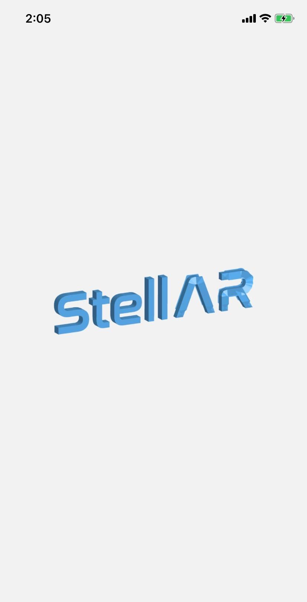
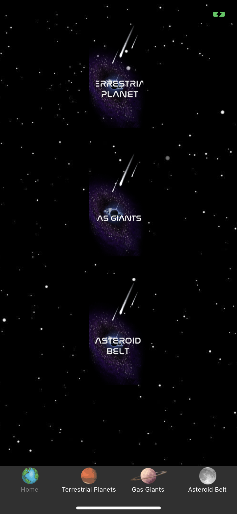

